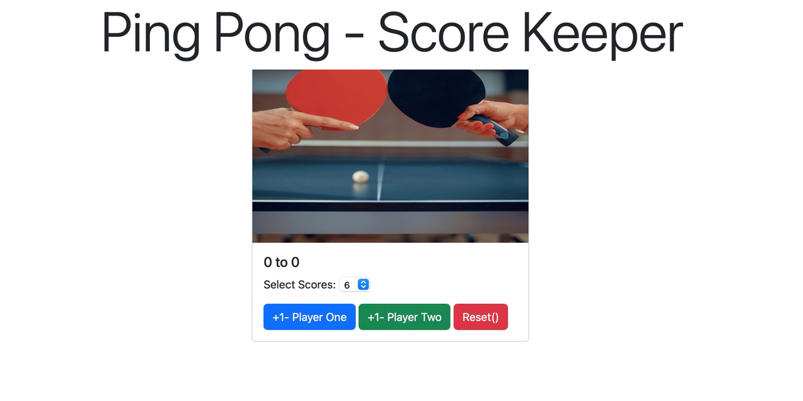

<div>
  <h1 align="center">PingPong Score Keeper in Javascript 🧑‍💻</h1>
  <h2 align="center"> A pratice for </h2>
<h3>Goals</h3>
  <ul>
  <li>
    Practicing querySelector()
  </li>
  <li>
    Practicing addEventListener()
  </li>

   </ul>

  <p>
    Screenshot:
  </p>

  <a href="">
    
  </a>
</div>

<hr />

## Requirements
- Javascript


## Main Parts

- addEventListener


```javascript
addEventListener("click", function () {
    score1++;

    scr1.innerText = score1;
    if (score1 == maxScore) {
        scr2.style.color = "red";
        scr1.style.color = "green";
        playerOne.disabled = "true";
        playerTwo.disabled = "true";
    }
})

```
- querySelector
```javascript
querySelector("#scores").addEventListener("change", function () {
    maxScore = document.querySelector("#scores").value;

})
```
# Just open pingpong.html with a browser